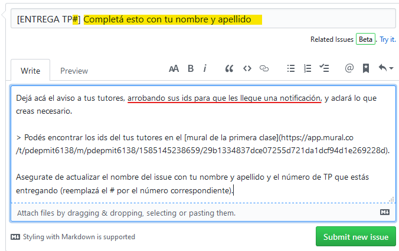

# Consigna TP0

## Objetivos

- :wrench: Que empieces a conocer algunas de las herramientas que vamos a estar usando durante la cursada, asegurando que te funcionen antes de que que sigamos avanzando con la práctica del paradigma funcional.
- :arrows_counterclockwise: Incorporar la ejecución de pruebas automáticas al flujo de trabajo, para asegurar que la solución propuesta cumpla con la funcionalidad esperada.
- :warning: Usar un entorno de desarrollo que te ayude a detectar y resolver problemas de forma temprana.
- :cloud: Usar un repositorio de código donde puedas subir tus cambios todas las veces que quieras, para que tus tutores puedan verlos y dejarte comentarios, así como también mantener un historial de lo que fuiste haciendo, sin miedo a perder tu trabajo.

> Tené en cuenta que las pruebas automáticas no se van a correr solamente en tu máquina, también se van a correr en un servidor luego de etiquetar el commit de entrega. La herramienta que se encargará de correr las pruebas, dejando los resultados disponibles para que tus tutores puedan verlos, se llama **GitHub Actions**.

## Parte 1: Preparación de entorno de trabajo

Para trabajar vas a necesitar tener instalado:
- **Git**
- **VSCode**, editor de texto recomendado (podés usar otro si lo preferís),
- **SWI-Prolog**.

> Para esta altura de la cursada se asume que ya tenés ciertas herramientas instaladas por haberlas usado para los TPs de funcional, por lo cual no se profundiza en ello. Ante cualquier problema técnico, consultá por el canal de Discord **#troubleshooting**.

- Podés instalar SWI-Prolog como se explica en la sección [**Ejecutable Prolog** de esta guía](https://github.com/pdep-utn/enunciados-miercoles-noche/blob/master/pages/prolog/entorno.md#ejecutable-prolog) armada por docentes del curso de los miércoles a la noche.
También incluye recomendaciones para problemas comunes en la instalación sobre Windows.

- La extensión sugerida para trabajar con Prolog en el VSCode es [VSC-Prolog](https://marketplace.visualstudio.com/items?itemName=arthurwang.vsc-prolog).

  > :warning: Es posible que luego de instalar la extensión te muestre un error en la solapa **OUTPUT** debido a un problema en la configuración por defecto de la extensión (puntualmente `prolog.executablePath`). Si eso pasa, revisá [estas instrucciones](https://github.com/pdep-utn/enunciados-miercoles-noche/blob/master/pages/prolog/entorno.md#configuraci%C3%B3n-adicional-para-windows) para solucionarlo.

## Parte 2: Probar tu entorno

### Primeros pasos  :hatching_chick:

1. Abrí una consola (puede ser una nativa de tu sistema operativo o Git Bash) y cloná este repositorio con el comando: `git clone urlParaClonarEsteRepo`.

   La URL la podés sacar de GitHub como se muestra acá:

   

2. Navegá al directorio nuevo con el comando `cd nombreDelRepo` y luego ejecutá `code .` para abrir el VSCode en ese lugar, o abrí el editor y elegí manualmente la carpeta que se te creó al clonar el repo (asegurate de estar sobre la raíz de tu proyecto cuando abras una terminal).

    Ahí vas a poder ver y editar los archivos que están en este repositorio, así como ejecutar el código Prolog desde una terminal dentro del mismo editor.

3. Luego de abrir una terminal desde el menú Terminal del VSCode (o con `ctrl-shift-ñ`) ejecutá el comando `swipl src/tp0.pl` para levantar SWI-Prolog con el código para **este TP** (para los siguientes asegurate de elegir el archivo correcto).

   > Alternativamente podés usar el programa SWI-Prolog que instalaste. El mismo ofrece una consola de Prolog similar, pero incluye menúes para buscar el archivo `.pl`, recargarlo y más opciones que no usaremos a lo largo de la cursada.
   >
   > Preferiremos usar SWI-Prolog desde la terminal integrada de VSCode solamente porque es cómodo y similar a como estuvimos trabajando en Haskell.

4. Una vez que se muestra el prompt de la consola de SWI-Prolog (`?-`) ejecutá: `run_tests.` (con punto incluído) para correr todas las pruebas.

   > **Importante:** todos los comandos y consultas que corras dentro de SWI-Prolog deben terminar con un `.` como se indicó más arriba. Si sólo se le da enter, sin el punto final, no alcanza para que se ejecute lo solicitado.

   A continuación debería mostrarse el resumen de haber corrido las pruebas, incluyendo algo como esto:
   ```
   % 2 tests failed
   % 0 tests passed
   ```
   y también debería incluir algunos detalles sobre qué fue lo que no funcionó como se esperaba.

   Si llegaste hasta acá sin sorpresas, felicitaciones!! :tada: Vas bien!

   Es esperable que los tests del TP0 **fallen**, ya que todavía no se implementó lo necesario en el archivo `src/tp0.pl` para que pasen.

   > :bulb: Vas a ver que vamos a estar usando `???` donde deberían ir los parámetros de los predicados a resolver, para indicar que necesitamos que existan dichos predicados. Esto permite que no se marque como un problema la ausencia de definiciones para los mismos.
   >
   > Si abrís el archivo `src/tp0.pl` encontrarás que eso es lo que se está usando inicialmente en la solución que te damos para el predicado `laRespuesta/1`.


### Trabajando con Prolog  :muscle:

El siguiente paso es jugar con Prolog para entender un poco más lo que está pasando y eventualmente hacer que los tests dejen de fallar.

1. En el archivo `src/tp0.pl` cambiá el `???` del predicado `laRespuesta/1` por el átomo `hola`, guardá los cambios y recargá tu programa con el comando `make.` , luego de lo cual volverán a correr los tests automáticamente.

   Deberías ver que el resultado de las pruebas todavía no es exitoso, indicando que se esperaba que fuera `42` pero se obtuvo `hola`.

2. Volvé a cambiar el valor para `laRespuesta/1`, esta vez usando el número `42`, y recargá tu programa para que se vuelvan a correr los tests. Confirmá que los tests del TP0 ahora sí pasan.

   El resumen final de ejecución debería decir:
   ```
   % PL-Unit: tests_tp0 .. done
   % All 2 tests passed
   ```

3. Además de correr las pruebas automáticas, podés hacer consultas manualmente en la consola de SWI-Prolog. Asegurate de probar consultas individuales y existenciales, como ser:
   ```
   ?- laRespuesta(japon).
   ?- laRespuesta(X).
   ```

   > :bulb: Notá que `japon` está en minúscula, porque es un **átomo**, mientras que `X` está en mayúscula, porque es una variable.

4. Para **salir** del intérprete de SWI-Prolog corré: `halt.`

> Para usar SWI-Prolog con la interfaz gráfica (al menos en Windows) alcanza con abrir el archivo deseado con extensión `.pl` desde el explorador del sistema operativo. Todo lo explicado anteriormente para ejecutar dentro de la consola de SWI-Prolog también aplica usando el intérprete de esta forma.

## Parte 3: Subir tus cambios a GitHub

Al igual que como estuviste haciendo anteriormente para funcional, en la terminal del sistema operativo (o gitbash) corré los siguientes comandos para:

1. Agregar todos tus cambios a lo que será tu siguiente commit:
   ```
   git add .
   ```
2. Commitear tus cambios con un mensaje representativo, como ser:
   ```
   git commit -m "Solución TP0"
   ```
   Tené en cuenta que eso sólo impacta a tu repositorio local (sigue estando sólo en tu máquina).
3. Subir tus cambios al repositorio remoto (GitHub):
   ```
   git push
   ```
4. Podés verificar que se subió correctamente entrando a la página de GitHub, al entrar a tu repositorio vas a encontrar el mensaje del último commit y cuándo fue que lo hiciste.

Ya sabés que podés subir tu solución tantas veces como quieras. **Es recomendable hacer commits chicos y frecuentes**, en vez de un solo gran commit con todo lo que se pida resolver.

## Parte 3: Actualizar el README

El **README** de un proyecto es básicamente una carta de presentación. Es común que incluya información útil para otras personas, y también un indicador de si las pruebas existentes funcionan, comúnmente conocido como Badge.

1. En el archivo `README.md` que está en la raíz del proyecto completá con tu **nombre y apellido** donde se indica.

2. Agregá el **Badge de GitHub Actions** en el lugar indicado. Una vez que termines el TP0 tu repo GitHub va a mostrar el Badge que da información respecto a si todas las pruebas que se encuentran en este proyecto pudieron correrse sin problemas.

   El texto a copiar en el `README.md` de modo que aparezca el Badge de GitHub Actions correctamente es el siguiente:

   ```
   [](https://github.com/pdep-mit/mini-tps-logico-2022-TuUsuarioDeGitHub/actions/workflows/build.yml)
   ```

   > :warning: ATENCIÓN: Asegurate de cambiar en los dos lugares en los que dice **TuUsuarioDeGitHub** por el nombre de usario que corresponda.

3. Luego de subir estos nuevos cambios al repositorio GitHub, creá un **tag** para etiquetar tu último commit. Esta acción disparará el proceso que corre las pruebas en el servidor de GitHub, luego de lo cual se actualizará la imagen del badge automáticamente.

   El etiquetado puede hacerse directamente desde GitHub, cuando estés por dejar un aviso a tus tutores de que realizaste la entrega en cuestión siguiendo estos pasos:

   - Hacer click en el link tags:

     

   - Elegir la opción Releases, y clickear en el botón para crear un nuevo release:

     

   - Indicar un número de versión:

     

     Podés elegir el número de versión como mejor te parezca. En el menú **Target** dejá la opción que aparece por defecto: **Target: main**.

   - Y así como está, no hace falta completar más nada, clickear el botón **Publish release** que está más abajo:

     

Eso es suficiente para que se dispare el proceso que corre las pruebas, y quede registrado el resultado de la ejecución en cuestión en base al código que está actualmente subido en tu repo, que es lo que nos interesa :+1:

## Parte 4: Avisar que terminaste el TP

Una vez que hayas terminado, al igual que para los TPs anteriores, avisanos creando un issue de esta forma:

1. En la página de issues de tu repo, creás un issue nuevo:

   

2. Clickeás en el botón para crear un issue de tipo **Entrega de TP**:

   

3. Completás el issue con la info correspondiente como se explica en el template (podés borrar el texto que ya viene, pero **no te olvides de arrobar a tus tutores** así les llega una notificación):

   

4. Luego de confirmar que está todo en orden, clickeás en el botón para crear el issue y listo! :tada:

De ahí en más, tus tutores van a darte el seguimiento necesario. Para los siguientes TPs la forma de entrega será la misma.

Ante cualquier problema técnico, recordá que podés contactarnos también por Discord, a través del canal **#troubleshooting**.
